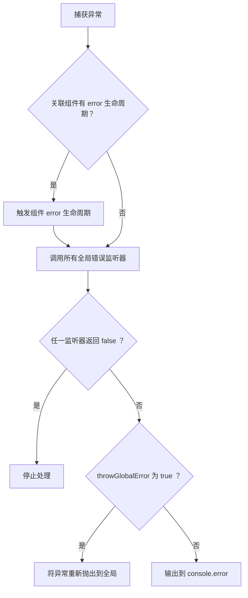

# 警告与错误

glass-easel 提供了全局的错误和警告处理机制。组件生命周期、事件回调等过程中抛出的异常会被 glass-easel 捕获，并通过错误监听器分发；常见的误用情况则会通过警告监听器提示。

## 错误监听器

### 注册与移除

通过 `addGlobalErrorListener` 注册一个全局错误监听器。监听器返回 `false` 可以阻止错误输出到 console ：

```js
const errorListener = (err, method, relatedComponent, element) => {
  console.log(err)              // 捕获的异常对象
  console.log(method)           // 抛出异常的方法名称
  console.log(relatedComponent) // 关联的组件实例（或组件路径字符串）
  console.log(element)          // 关联的节点

  // 返回 false 将取消 console 输出
  return false
}

glassEasel.addGlobalErrorListener(errorListener)
```

不再需要时，使用 `removeGlobalErrorListener` 移除：

```js
glassEasel.removeGlobalErrorListener(errorListener)
```

### 错误处理流程

当一个错误被捕获时， glass-easel 按照以下顺序处理：



如果没有注册任何监听器，或所有监听器都未返回 `false` ，错误信息默认会输出到 `console.error` 。

### 组件级错误捕获

除了全局监听器外，组件自身也可以通过 `error` 生命周期来捕获该组件内部的异常：

```js
export const myComponent = componentSpace
  .define()
  .lifetime('error', function (err) {
    console.log('component error:', err)
  })
  .registerComponent()
```

`error` 生命周期会在全局错误监听器之前被触发。

> 📖 关于生命周期的详细说明请参阅 [生命周期](../basic/lifetime.md) 文档。

## 警告监听器

### 注册与移除

通过 `addGlobalWarningListener` 注册一个全局警告监听器。同样，返回 `false` 可以阻止警告输出到 console ：

```js
const warningListener = (message, relatedComponent, element) => {
  console.log(message)          // 警告信息
  console.log(relatedComponent) // 关联的组件实例（或组件路径字符串）
  console.log(element)          // 关联的节点

  // 返回 false 将取消 console 输出
  return false
}

glassEasel.addGlobalWarningListener(warningListener)
```

不再需要时，使用 `removeGlobalWarningListener` 移除：

```js
glassEasel.removeGlobalWarningListener(warningListener)
```

## 手动触发错误与警告

除了 glass-easel 内部自动捕获的异常外，也可以通过 `dispatchError` 和 `triggerWarning` 手动触发：

```js
// 手动触发错误
glassEasel.dispatchError(
  new Error('something went wrong'), // 错误对象
  'myMethod',                        // 抛出异常的方法名称
  myComponent,                       // 关联的组件实例（或组件路径字符串）
  myElement,                         // 关联的节点
)

// 手动触发告警
glassEasel.triggerWarning(
  'This usage is deprecated',        // 警告信息
  myComponent,                       // 关联的组件实例（或组件路径字符串）
  myElement,                         // 关联的节点
)
```

手动触发的错误和警告会经过与自动捕获完全相同的处理流程（包括监听器回调和 console 输出）。

## 安全回调 `safeCallback`

`safeCallback` 是 glass-easel 提供的安全函数调用包装器。它会用 try-catch 包裹函数调用，捕获的异常会自动进入上述错误处理流程。

```js
const result = glassEasel.safeCallback(
  'MyOperation',     // 操作类型名称，用于错误信息中标识来源
  myFunction,        // 要调用的函数
  thisArg,           // 函数的 this 绑定
  [arg1, arg2],      // 传给函数的参数数组
  relatedComponent,  // 关联的组件实例（可选）
)
```

如果函数正常执行，`safeCallback` 会返回其返回值；如果抛出异常，则返回 `undefined` 。

这在需要执行一段不可信或可能出错的回调时非常有用，可以确保异常不会中断外层逻辑，同时错误仍然能被正常上报：

```js
// wrap a user callback so that errors are handled gracefully
function runUserCallback(cb, component) {
  const result = glassEasel.safeCallback('UserCallback', cb, null, [], component)
  // even if cb throws, execution continues here
  console.log('callback result:', result) // undefined if cb threw
}
```

glass-easel 内部在以下场景中默认使用了 `safeCallback` ，因此这些场景中的异常都会被自动捕获并进入错误处理流程：

| 场景分类 | 具体场景 |
| --- | --- |
| **生命周期** | `created` / `attached` / `detached` 等生命周期回调、页面生命周期回调 |
| **事件** | 事件监听器回调 |
| **组件初始化** | `.init()` 中的初始化函数 |
| **数据** | `.data()` 中的数据生成器函数、属性 `default` 函数 |
| **观察器** | 数据观察器（`observer`）、属性观察器、属性比较器（`comparer`） |
| **组件关系** | `linked` / `unlinked` / `linkChanged` / `linkFailed` 回调 |
| **其他** | `ComponentSpace.groupRegister()` 回调、后端渲染完成回调、`MutationObserver` 回调 |

## `globalOptions.throwGlobalError`

默认情况下，未被监听器拦截的错误只会输出到 `console.error` 。将 `throwGlobalError` 设为 `true` 后，这些错误会被重新抛出到全局，这在测试场景中非常有用：

```js
// useful in testing to make errors fail the test
glassEasel.globalOptions.throwGlobalError = true
```

> 📖 关于 `globalOptions` 的完整说明请参阅 [全局选项](./component_options.md#环境选项) 文档。
