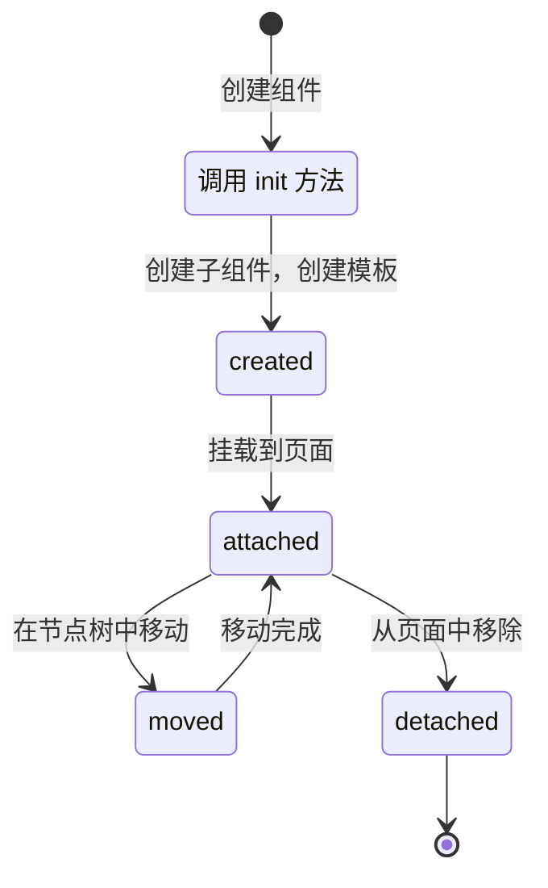

# 生命周期

## 普通生命周期

组件可以定义一些生命周期回调函数。最常见的是 `attached` 生命周期，它在组件被添加到页面内后立刻触发，例如：

```js
// 使用 Definition API 添加生命周期回调函数
export const myComponent = componentSpace.defineComponent({
  lifetimes: {
    attached() {
      // 组件被添加到页面后触发
    },
  },
})
// 或使用 Chaining API 添加生命周期回调函数
export const myComponent = componentSpace.define()
  .lifetime('attached', function () {
    // 组件被添加到页面后触发
  })
  .registerComponent()
// 或在 init 中添加生命周期回调函数
export const myComponent = componentSpace.define()
  .init(function ({ lifetime }) {
    lifetime('attached', function () {
      // 组件被添加到页面后触发
    })
  })
  .registerComponent()
```

glass-easel 会自动触发的生命周期列表如下。

| 生命周期 | 触发时机 | 触发次数 | 注意事项 |
| -------- | -------- | ------ | -------- |
| `created` | 组件实例刚刚被创建完时触发 | 每个实例触发一次 | 组件还未添加到页面节点树中，不能通过组件节点向上查找父节点或其他兄弟节点。|
| `attached` | 组件实例被添加到页面后触发 | 每个实例最多触发一次 | |
| `moved` | 组件实例在节点树中位置被移动后触发 | 只有 `wx:for` 内项目可能触发，次数不定 | |
| `detached` | 组件实例被从页面内移除后触发 | 每个实例最多触发一次 | 组件已被移除，不再位于节点树中，不应再操作节点或更新数据。|

### 生命周期状态轮转示意图



## 其他生命周期

除了上述常用生命周期外， glass-easel 还支持以下非常用生命周期。

| 生命周期 | 触发时机 | 备注 |
| -------- | -------- | ---- |
| `ready` | 组件准备就绪时触发 | glass-easel 不会自动触发，需要外部通过 `this.triggerLifetime('ready', [])` 手动触发 |
| `error` | 组件内的生命周期回调或事件回调抛出异常时触发 | 回调参数为 `(err: unknown)` ，可用于组件级别的错误捕获 |
| `listenerChange` | 组件上的事件监听器被添加或移除时触发 | 回调参数为 `(isAdd, name, func, options)` ，需要在组件选项中开启 `listenerChangeLifetimes: true` |
| `workletChange` | worklet 值发生变化时触发 | 回调参数为 `(name, value)` ，需要通过 `this.triggerWorkletChangeLifetime(name, value)` 手动触发 |

## 页面生命周期

页面生命周期是一类特殊的生命周期。 glass-easel 不会主动触发页面生命周期，只能通过调用组件实例的 `this.triggerPageLifetime` 来触发。

触发时，页面生命周期会自动递归到所有子孙组件上。因而它主要用于广播一些全局事件。

```js
// 使用 Definition API 添加页面生命周期回调函数
export const myComponent = componentSpace.defineComponent({
  pageLifetimes: {
    someLifetime() { /* ... */ },
  },
})
// 或使用 Chaining API 添加页面生命周期回调函数
export const myComponent = componentSpace.define()
  .pageLifetime('someLifetime', function () { /* ... */ })
  .registerComponent()
// 或在 init 中添加页面生命周期回调函数
export const myComponent = componentSpace.define()
  .init(function ({ pageLifetime }) {
    pageLifetime('someLifetime', function () { /* ... */ })
  })
  .registerComponent()
```
