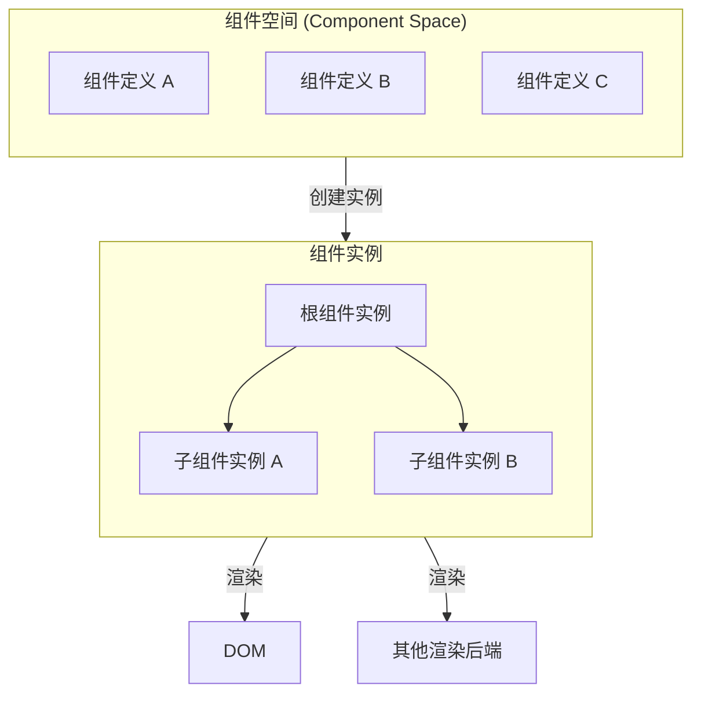
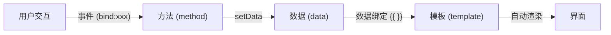
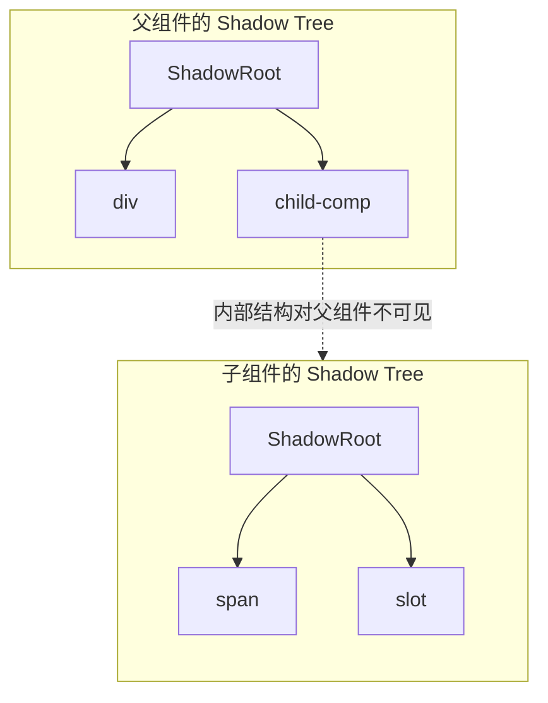
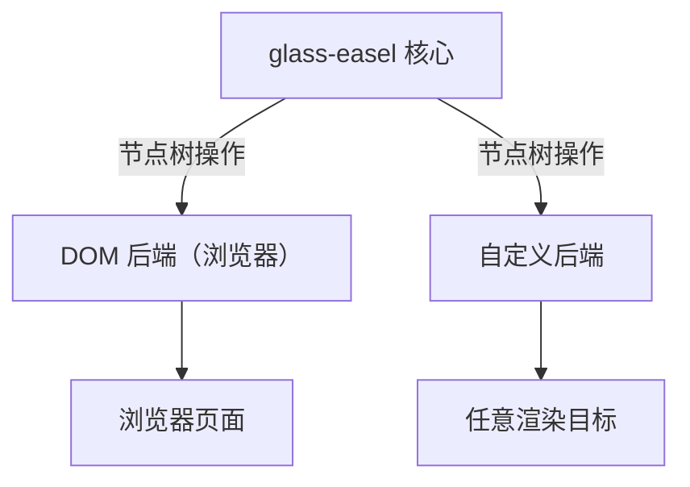

# 框架思维

## 核心概念

在开始之前，了解以下核心概念会帮助你更好地使用 glass-easel：



## 声明式

glass-easel 采用 **声明式** 的界面开发方式：你只需要描述界面 **应该是什么样子** ，框架会自动处理界面的更新。

具体来说，你通过模板来描述界面结构，通过数据绑定将组件数据映射到模板中：

```js
const Counter = componentSpace.define()
  .template(wxml(`
    <div>当前计数：{{ count }}</div>
  `))
  .data(() => ({
    count: 0,
  }))
  .registerComponent()
```

当数据变化时（通过 `setData` 更新），框架会自动计算出需要变更的部分并高效地更新界面——你不需要手动操作 DOM。



这与命令式的 DOM 操作形成鲜明对比：

| | 声明式（glass-easel） | 命令式（原生 DOM） |
|---|---|---|
| 关注点 | 描述界面的最终状态 | 描述界面如何变化 |
| 数据更新 | `setData({ count: 1 })` | `element.textContent = '1'` |
| 列表变更 | 修改数组数据，自动 diff 更新 | 手动增删 DOM 节点 |

> 📖 更多模板语法请参阅 [模板](./template.md) 文档。

## 组件隔离

glass-easel 在多个层面实现了组件之间的隔离，使得每个组件都是一个独立、可复用的单元。

### 节点树隔离（Shadow Tree）

glass-easel 借鉴了 Web Components 的 Shadow DOM 概念。每个组件实例拥有独立的 **Shadow Tree** ，组件内部的节点结构对外部是不可见的：



这意味着：
- 父组件无法直接访问子组件内部的节点
- 子组件的内部结构变更不会影响外部使用方
- 组件之间通过 **属性** 和 **事件** 进行通信

> 📖 更多节点树概念请参阅 [节点树与节点类型](../tree/node_tree.md) 文档。

### 样式隔离

通过 **style scope** 机制，glass-easel 支持将组件样式限定在组件内部，避免样式冲突：

```js
const myStyleScope = componentSpace.styleScopeManager.register('my-prefix')

const MyComp = componentSpace.defineComponent({
  options: {
    styleScope: myStyleScope,
  },
  template: compileTemplate(`
    <div class="header">不会被外部 .header 样式影响</div>
  `),
})
```

> 📖 更多样式隔离方式请参阅 [样式隔离](../styling/style_isolation.md) 文档。

## 多后端

glass-easel 的一个核心设计目标是 **与渲染环境解耦** 。框架本身只负责组件管理和节点树维护，实际的渲染工作由 **后端（Backend）** 完成。



这意味着：

- **同一份组件代码** 可以运行在浏览器等不同环境中
- 切换渲染环境时，只需替换后端实现，组件逻辑无需修改
- 你可以实现自定义后端，将 glass-easel 的节点树渲染到任意目标

glass-easel 提供了三种后端协议模式，可根据需要选择实现：

| 协议模式 | 说明 |
| -------- | ---- |
| Composed Mode | 首选的协议，相对简单易用 |
| Shadow Mode | 针对 Shadow Tree 的协议，性能通常最优，但协议本身较复杂 |
| DOM-like Mode | 适用于 DOM 的协议，通常只用于适配浏览器 DOM 接口 |

> 📖 如何实现自定义后端请参阅 [自定义后端](../advanced/custom_backend.md) 文档。
