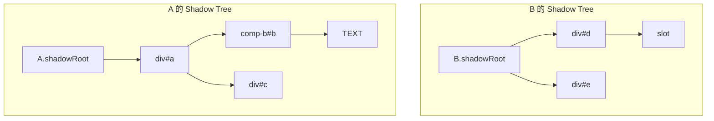
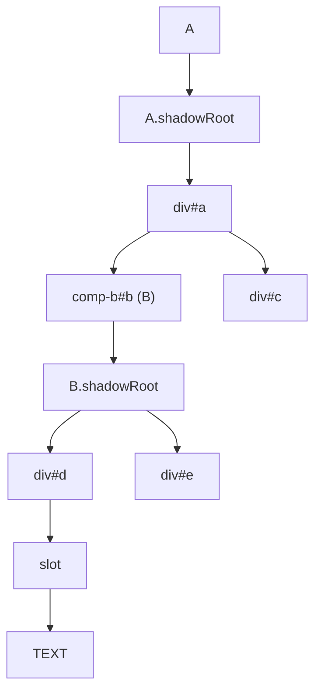
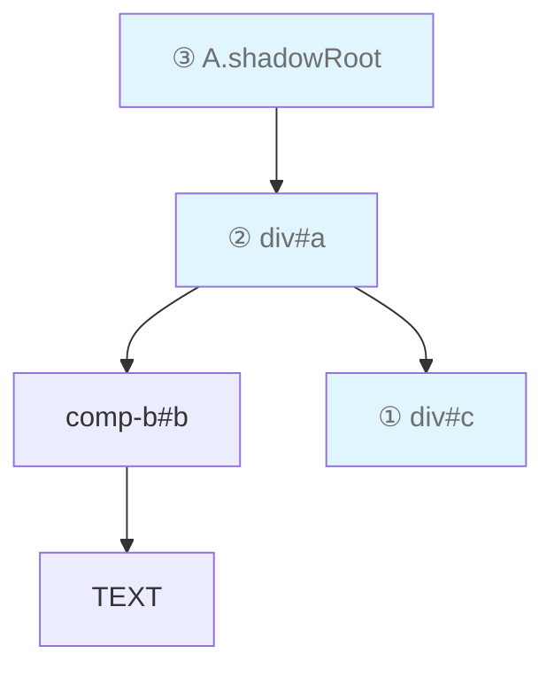
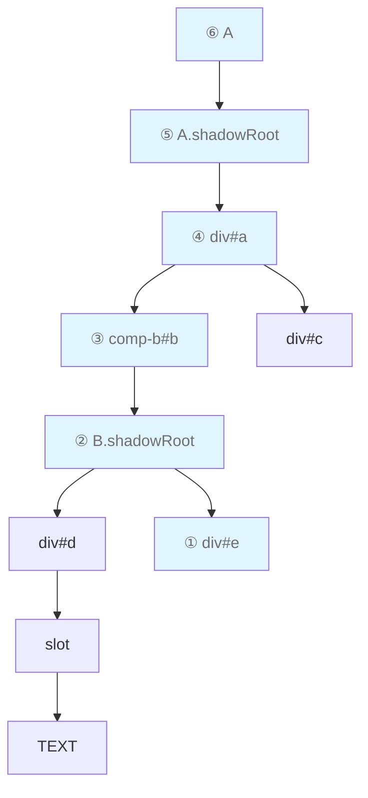
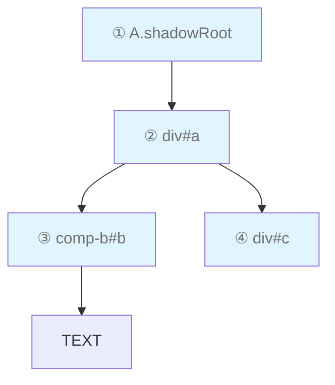
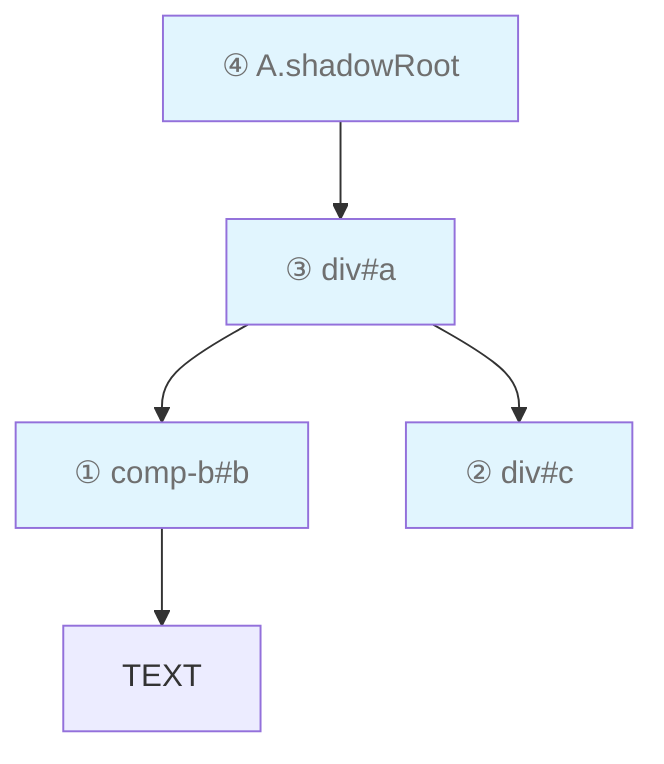
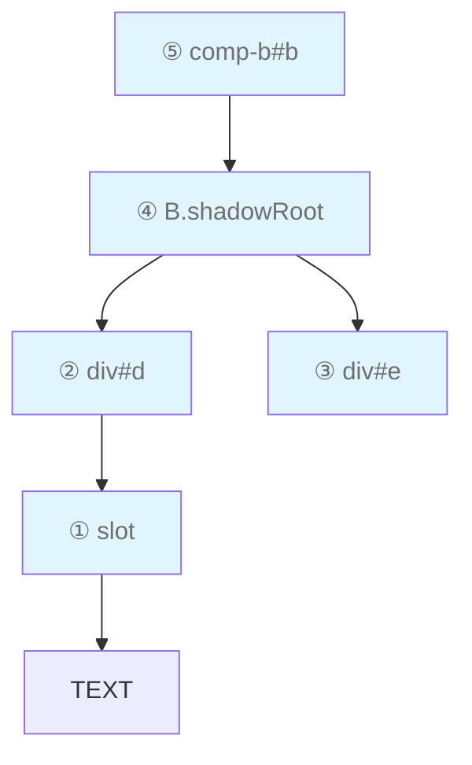

# 节点树遍历

`ElementIterator` 是一个便利对象，他提供了对节点树进行遍历的能力，而不需要手动通过 `childNodes`, `parentNode` 等 API 进行遍历。它支持在 [Shadow Tree](./node_tree.md#shadow-tree) 和 [Composed Tree](./node_tree.md#composed-tree) 上用不同模式进行遍历。

> 📖 关于 `ElementIterator` 的完整 API 说明请参阅 [ElementIterator API](../api/other.md#elementiterator) 文档。

## 基本用法

创建 `ElementIterator` 后，可以用 `forEach` 或 `for...of` 两种方式进行遍历：

```js
// 方式一：forEach（返回 false 可中断遍历）
glassEasel.ElementIterator.create(
  root,
  glassEasel.ElementIteratorType.ShadowDescendantsRootFirst,
).forEach((node) => {
  console.log(node)
  // return false // 取消注释可中断遍历
})

// 方式二：for...of
for (const node of glassEasel.ElementIterator.create(
  root,
  glassEasel.ElementIteratorType.ShadowDescendantsRootFirst,
)) {
  console.log(node)
  // break // 可用 break 中断
}
```

## 示例树结构

以下各模式的说明均以这个组件结构为例：

```xml
<!-- 组件 A 的模板 -->
<div id="a">
  <comp-b id="b"> TEXT </comp-b>
  <div id="c"></div>
</div>
```

```xml
<!-- 组件 B 的模板 -->
<div id="d"><slot /></div>
<div id="e"></div>
```

它对应的 Shadow Tree 和 Composed Tree 如下（关于两者的区别请参阅 [节点树结构](./node_tree.md) 文档）：





## 祖先遍历

祖先遍历从指定节点出发，沿着父节点链向上遍历，直到根节点。

### `ShadowAncestors`

在 Shadow Tree 上向上遍历。遍历路径不会穿越组件边界，到达组件的 `shadowRoot` 后停止（不会进入父组件的 Shadow Tree ）。

```js
// 从 div#c 出发，沿 Shadow Tree 向上遍历
// 遍历顺序：div#c → div#a → A.shadowRoot
glassEasel.ElementIterator.create(A.$.c, glassEasel.ElementIteratorType.ShadowAncestors).forEach(
  (node) => {
    console.log(node)
  },
)
```



### `ComposedAncestors`

在 Composed Tree 上向上遍历。遍历路径会穿越 Shadow 边界和 slot 分发边界，一直向上直到根节点。

```js
// 从 div#e 出发，沿 Composed Tree 向上遍历
// 遍历顺序：div#e → B.shadowRoot → comp-b#b → div#a → A.shadowRoot → A
glassEasel.ElementIterator.create(B.$.e, glassEasel.ElementIteratorType.ComposedAncestors).forEach(
  (node) => {
    console.log(node)
  },
)
```



## 子孙遍历（先根 / 后根）

子孙遍历从指定节点出发，递归遍历其所有子孙节点。先根遍历（ root-first ）先访问父节点再访问子节点，后根遍历（ root-last ）先访问子节点再访问父节点。

### `ShadowDescendantsRootFirst`

在 Shadow Tree 上先根遍历。只遍历同一层 Shadow Tree 中的节点，不会深入子组件的 Shadow Tree 。

```js
// 从 A.shadowRoot 出发，先根遍历 Shadow Tree
// 遍历顺序：A.shadowRoot → div#a → comp-b#b → div#c
// 默认情况下，ElementIterator 只会遍历 Element 类型，所以会跳过 `TEXT` 节点
glassEasel.ElementIterator.create(
  A.shadowRoot,
  glassEasel.ElementIteratorType.ShadowDescendantsRootFirst,
).forEach((node) => {
  console.log(node)
})
```



### `ShadowDescendantsRootLast`

在 Shadow Tree 上后根遍历。叶子节点先被访问，根节点最后被访问。

```js
// 从 A.shadowRoot 出发，后根遍历 Shadow Tree
// 遍历顺序（仅 Element ）：comp-b#b → div#c → div#a → A.shadowRoot
// 默认情况下，ElementIterator 只会遍历 Element 类型，所以会跳过 `TEXT` 节点
glassEasel.ElementIterator.create(
  A.shadowRoot,
  glassEasel.ElementIteratorType.ShadowDescendantsRootLast,
).forEach((node) => {
  console.log(node)
})
```



### `ComposedDescendantsRootFirst`

在 Composed Tree 上先根遍历。会穿越 Shadow 边界和 slot 边界，将整个渲染树完整遍历。

```js
// 从 comp-b#b 出发，先根遍历 Composed Tree
// 遍历顺序：comp-b#b → B.shadowRoot → div#d → slot → div#e
// 默认情况下，ElementIterator 只会遍历 Element 类型，所以会跳过 `TEXT` 节点
glassEasel.ElementIterator.create(
  B,
  glassEasel.ElementIteratorType.ComposedDescendantsRootFirst,
).forEach((node) => {
  console.log(node)
})
```


### `ComposedDescendantsRootLast`

在 Composed Tree 上后根遍历。叶子节点先被访问，根节点最后被访问。

```js
// 从 comp-b#b 出发，后根遍历 Composed Tree
// 遍历顺序：slot → div#d → div#e → B.shadowRoot → comp-b#b
// 默认情况下，ElementIterator 只会遍历 Element 类型，所以会跳过 `TEXT` 节点
glassEasel.ElementIterator.create(
  B,
  glassEasel.ElementIteratorType.ComposedDescendantsRootLast,
).forEach((node) => {
  console.log(node)
})
```



## 限制返回的节点类型

默认情况下，遍历器只返回 `Element` 类型的节点（不包括文本节点）。可以通过第三个参数 `nodeTypeLimit` 来调整返回范围：

| 值                 | 返回范围                     |
| ------------------ | ---------------------------- |
| `Element` （默认） | 所有元素节点（不含文本节点） |
| `Component`        | 仅组件节点                   |
| `NativeNode`       | 仅 NativeNode                |
| `ShadowRoot`       | 仅 ShadowRoot                |
| `VirtualNode`      | 仅 VirtualNode               |
| `TextNode`         | 仅文本节点                   |
| `Object`           | 所有节点（包含文本节点）     |

```js
// 只遍历组件
glassEasel.ElementIterator.create(
  root,
  glassEasel.ElementIteratorType.ShadowDescendantsRootFirst,
  glassEasel.Component,
).forEach((comp) => {
  console.log('Component:', comp.is)
})

// 遍历所有节点（包含文本节点）
glassEasel.ElementIterator.create(
  root,
  glassEasel.ElementIteratorType.ShadowDescendantsRootFirst,
  Object,
).forEach((node) => {
  console.log(node)
})
```

## 中断遍历

在遍历过程中可以提前中断。使用 `forEach` 时在回调中返回 `false` 即可中断；使用 `for...of` 时使用 `break` 即可。

```js
// forEach 方式中断
glassEasel.ElementIterator.create(
  root,
  glassEasel.ElementIteratorType.ShadowDescendantsRootFirst,
).forEach((node) => {
  if (someCondition(node)) {
    return false // 中断遍历
  }
})

// for...of 方式中断
for (const node of glassEasel.ElementIterator.create(
  root,
  glassEasel.ElementIteratorType.ShadowDescendantsRootFirst,
)) {
  if (someCondition(node)) {
    break // 中断遍历
  }
}
```

### 跳过子树

使用 `ElementIterator` 的迭代器接口时，可以在先根遍历中跳过当前节点的整个子树。向 `next()` 传入 `false` 即可实现：

```js
const iterator = glassEasel.ElementIterator.create(
  root,
  glassEasel.ElementIteratorType.ShadowDescendantsRootFirst,
  Object,
)[Symbol.iterator]()

for (let it = iterator.next(); !it.done; ) {
  const node = it.value
  console.log(node)

  if (shouldSkipChildren(node)) {
    // 跳过当前节点的子树，直接访问下一个兄弟节点
    it = iterator.next(false)
  } else {
    it = iterator.next()
  }
}
```

> ⚠️ 跳过子树功能只在先根遍历（ root-first ）模式下有意义，后根遍历和祖先遍历中传入 `false` 会直接中断遍历。
