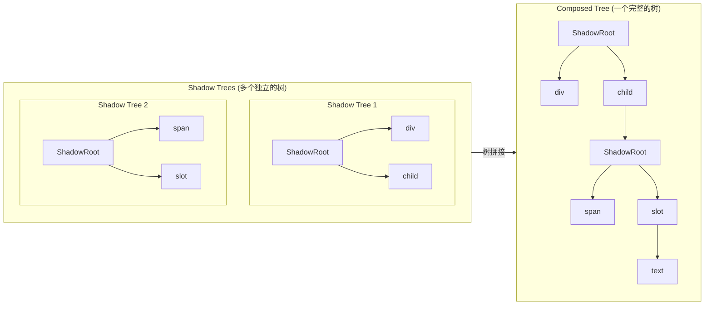
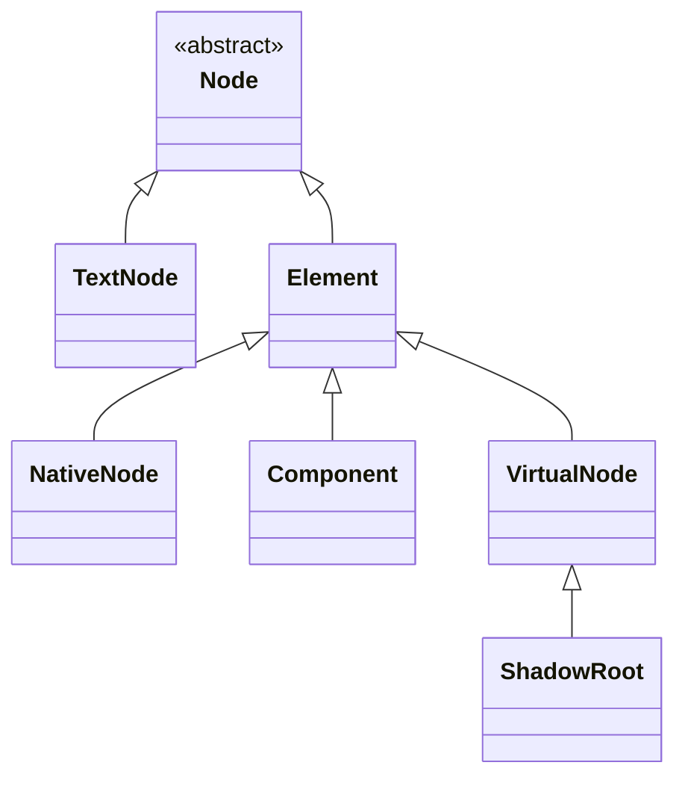

# 节点树与节点类型

## 概述

在 glass-easel 中，节点的组织采用了类似 Web Components 的 Shadow DOM 概念：

- **Shadow Tree（影子树）**：每个组件实例拥有一个独立的节点树，代表组件自身的模板结构
- **Composed Tree（组合树）**：将所有 Shadow Tree 组合拼接后形成的完整节点树



## Shadow Tree

Shadow Tree 是组件模板实例化后形成的节点树。每个组件实例都有且仅有一个 Shadow Tree，其特点是：

1. **独立性**：每个 Shadow Tree 只包含组件自身模板中的节点
2. **封装性**：Shadow Tree 内部结构对外部是隐藏的
3. **以 ShadowRoot 为根**：每个 Shadow Tree 都以 `ShadowRoot` 节点作为根节点

例如，对于一个由以下两个组件构成的页面：

```js
export const childComponent = componentSpace.defineComponent({
  template: compileTemplate(`
    <div>Text in childComponent</div>
    <slot />
  `),
})

export const myComponent = componentSpace.defineComponent({
  using: {
    child: childComponent,
  },
  template: compileTemplate(`
    <div class="blue" />
    <child>
      <span>{{ text }}</span>
    </child>
  `),
  data: { text: 'Text in myComponent' },
})
```

这个页面中，包含两个 Shadow Tree 。其一是根组件 myComponent 的 Shadow Tree ：

```html
<!-- myComponent -->
<shadowRoot>
  <div class="blue">
  <child>
    <span>
      "Text in myComponent"
```

其二是 childComponent 的 Shadow Tree ：

```html
<!-- childComponent -->
<shadowRoot>
  <div>
    "Text in childComponent"
  <slot>
```

Shadow Tree 有几个关键特点：

* Shadow Tree 是一个组件实例自身模板中包含的节点，包括 slot 节点本身，但**不包括**组件的使用者放入 slot 中的内容；
* 每个 Shadow Tree 都以一种特殊的 `ShadowRoot` 节点为根节点。

## Composed Tree

Shadow Tree 不能直接用于最终的页面，还需要经过一个 **树拼接** 过程，将所有 Shadow Tree 拼成一个大的 **Composed Tree** 。

这个拼接过程中:

1. 组件节点会与其 `ShadowRoot` 进行组合
2. slot 节点会被填入相应的 slot 内容
3. 最终形成一棵完整的节点树

继续使用上面的例子:

```html
<!-- 拼接前 myComponent -->
<shadowRoot>
  <div class="blue">
  <child>
    <span>
      "Text in myComponent"
```

```html
<!-- 拼接前 childComponent -->
<shadowRoot>
  <div>
    "Text in childComponent"
  <slot>
```

经过树拼接后，形成如下所示的 Composed Tree ：

```html
<!-- 拼接后的完整 Composed Tree -->
<shadowRoot>
  <div class="blue">
  <child>
    <!-- 下方是拼接进来的 -->
    <shadowRoot>
      <div>
        "Text in childComponent"
      <slot>
        <!-- 下方是拼接进来的 -->
        <span>
          "Text in myComponent"
```

## 最终 DOM 节点树

Composed Tree 中包含一些 **虚拟节点** （如 `ShadowRoot`、`slot`），这些节点在最终的 DOM 中并不真实存在。去除这些虚拟节点后，就得到了实际渲染到页面上的 DOM 结构：

```html
<!-- Composed Tree -->
<shadowRoot> <!-- 虚拟节点 -->
  <div class="blue">
  <child>
    <shadowRoot> <!-- 虚拟节点 -->
      <div>
        "Text in childComponent"
      <slot> <!-- 虚拟节点 -->
        <span>
          "Text in myComponent"
```

```html
<!-- 最终 DOM 节点树 -->
<div class="blue">
  <child>
    <div>
      "Text in childComponent"
    <span>
      "Text in myComponent"
```

## 节点类型

在 glass-easel 中，你可能会遇到以下几种节点类型：

| 节点类型 | 类名 | 说明 |
|---------|------|------|
| 文本节点 | `glassEasel.TextNode` | 文本内容节点 |
| 普通节点 | `glassEasel.NativeNode` | 普通节点，如 `<div>` |
| 组件节点 | `glassEasel.Component` | 自定义组件 |
| 虚拟节点 | `glassEasel.VirtualNode` | 虚拟节点 |
| Shadow树根节点 | `glassEasel.ShadowRoot` | Shadow树根节点 |

类继承关系：



## 直接树访问

访问组件实例的 `this.shadowRoot` 属性可以获取到这个组件实例对应的 `ShadowRoot` 节点。进而通过每个节点的 `childNodes` 数组可以直接访问到每个节点。例如：

```js
export const childComponent = componentSpace.defineComponent({
  template: compileTemplate(`
    <div>Text in childComponent</div>
    <slot />
  `),
  lifetimes: {
    attached() {
      const shadowRoot = this.shadowRoot
      const textNode = shadowRoot.childNodes[0].childNodes[0]
      textNode.textContent === 'Text in childComponent' // true
    },
  },
})
```

常用 Shadow 树访问:

| API | 说明 |
|-----|------|
| `glassEasel.Element#childNodes` | 当前节点的所有 Shadow Tree 子节点列表 |
| `glassEasel.Element#parentNode` | 当前节点的 Shadow Tree 父节点 |
| `glassEasel.Element#ownerShadowRoot` | 当前节点所在 Shadow Tree 的 `ShadowRoot`  |
| `glassEasel.Component#shadowRoot` | 当前组件节点的 `ShadowRoot` ，对于 [外部组件](../advanced/external_component.md) 是一个 `glassEasel.ExternalShadowRoot`  |
| `glassEasel.Component#getShadowRoot()` | 当前组件节点的 `ShadowRoot` ，对于 [外部组件](../advanced/external_component.md) 返回空 |
| `glassEasel.ShadowRoot#getHostNode()` | 当前 `ShadowRoot` 对应的组件节点 |

常用 Composed 树访问：

| API | 说明 |
|-----|------|
| `glassEasel.Element#getComposedChildren()` | 当前节点的所有 Composed Tree 子节点列表 |
| `glassEasel.Element#getComposedParent()` | 当前节点的 Composed Tree 父节点 |

注意：不要直接修改这些属性。

如果只是进行常规的树遍历，可以使用 [节点树遍历](element_iterator.md) 接口。

## 调试输出节点树

如果只是想临时输出节点树结构信息供调试使用，可以使用 `dumpElement` 或 `dumpElementToString` 方法：

```js
componentSpace.defineComponent({
  lifetimes: {
    attached() {
      // 在 console 中输出 Shadow Tree
      glassEasel.dumpElement(this.shadowRoot, false)
      // 在 console 中输出 Composed Tree
      glassEasel.dumpElement(this, true)
    },
  },
})
```

## 延伸阅读

- [slot 及 slot 类型](../interaction/slot.md) - 了解 slot 及 slot 类型
- [节点树遍历](element_iterator.md) - 使用 ElementIterator 进行树遍历
- [选择器查询](selector.md) - 使用 CSS 选择器查询节点
