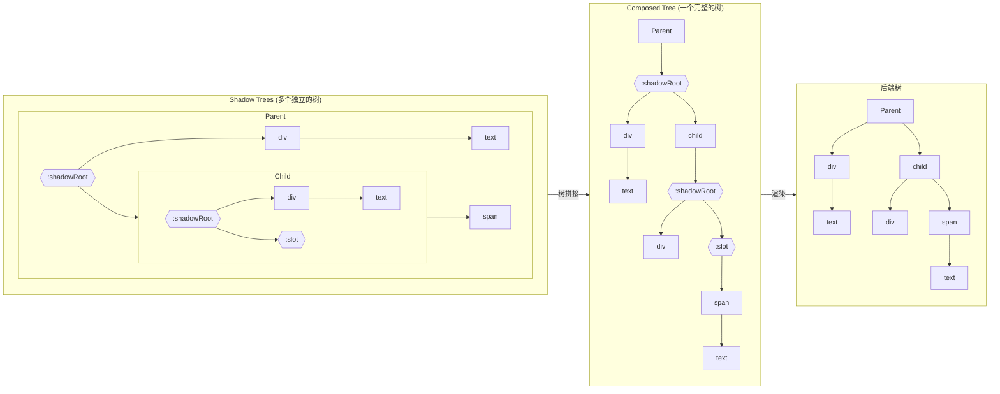
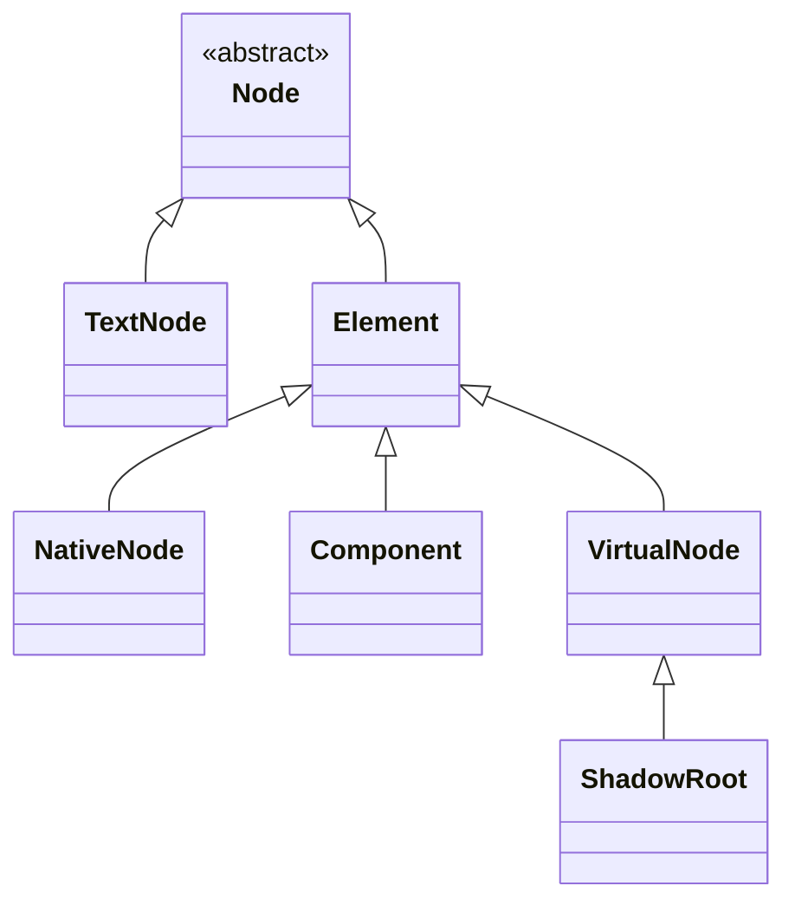
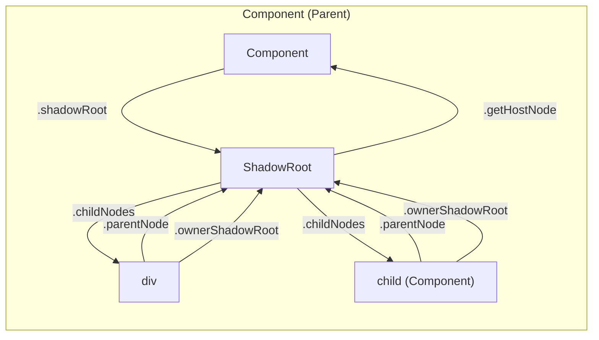

# 节点树与节点类型

## 概述

在 glass-easel 中，节点的组织采用了类似 Web Components 的 Shadow DOM 概念。glass-easel 中一共存在 3 种树概念：

- **Shadow Tree**：每个组件实例拥有一个独立的节点树，代表组件自身的模板结构
- **Composed Tree**：将所有 Shadow Tree 组合拼接后形成的完整节点树
- **Backend Tree**：渲染后端节点组成的节点数，在 webview 后端中，就是最终渲染的 DOM 树。



## Shadow Tree

Shadow Tree 是组件模板实例化后形成的节点树。每个组件实例都有且仅有一个 Shadow Tree，其特点是：

1. **独立性**：每个 Shadow Tree 只包含组件自身模板中的节点
2. **封装性**：Shadow Tree 内部结构对外部是隐藏的
3. **以 ShadowRoot 为根**：每个 Shadow Tree 都以 `ShadowRoot` 节点作为根节点

例如，对于一个由以下两个组件构成的页面：

```js
const Child = componentSpace.define()
  .template(wxml(`
    <div>Text in Child component</div>
    <slot />
  `))
  .registerComponent()

const Parent = componentSpace.define()
  .usingComponents({
    Child,
  })
  .template(wxml(`
    <div class="blue" />
    <child>
      <span>{{ text }}</span>
    </child>
  `))
  .data(() => ({
    text: 'Text in Parent',
  }))
  .registerComponent()
```

这个页面中，包含两个 Shadow Tree 。其一是根组件 Parent 的 Shadow Tree ：

```html
<!-- Parent Shadow Tree -->
<:shadowRoot>
  <div class="blue">
  <child>
    <span>
      "Text in Parent"
```

其二是 Child 的 Shadow Tree ：

```html
<!-- Child Shadow Tree -->
<:shadowRoot>
  <div>
    "Text in Child"
  <:slot>
```

> 节点名字前的冒号表示该节点是一个虚拟节点

Shadow Tree 有几个关键特点：

* Shadow Tree 是一个组件实例自身模板中包含的节点，包括 slot 节点本身，但**不包括**组件的使用者放入 slot 中的内容；
* 每个 Shadow Tree 都以一种特殊的 `ShadowRoot` 节点为根节点。

## Composed Tree

Shadow Tree 不能直接用于最终的页面，还需要经过一个 **树拼接** 过程，将所有 Shadow Tree 拼成一个大的 **Composed Tree** 。

这个拼接过程中:

1. 组件节点会与其 `ShadowRoot` 进行组合
2. slot 节点会被填入相应的 slot 内容
3. 最终形成一棵完整的节点树

继续使用上面的例子:

```html
<!-- Parent -->
<:shadowRoot>
  <div class="blue">
  <child>
    <span>
      "Text in Parent"
```

```html
<!-- 拼接前 Child -->
<:shadowRoot>
  <div>
    "Text in Child"
  <:slot>
```

经过树拼接后，形成如下所示的 Composed Tree ：

```html
<!-- 拼接后的完整 Composed Tree -->
<parent>
  <:shadowRoot>
    <div class="blue">
    <child>
      <!-- 下方是拼接进来的 -->
      <:shadowRoot>
        <div>
          "Text in Child"
        <:slot>
          <!-- 下方是拼接进来的 -->
          <span>
            "Text in Parent"
```

## Backend Tree

Backend Tree（后端树）是最终在渲染后端上创建的节点树。glass-easel 本身只负责组件管理和节点树维护，实际的渲染工作由 **后端（Backend）** 完成。最常见的后端是 DOM 后端，此时后端树就对应浏览器中的 DOM 节点树。除此之外，也可以使用 [自定义后端](../advanced/custom_backend.md) 将节点树渲染到其他目标环境中。

Composed Tree 中包含一些 **虚拟节点** （如 `ShadowRoot`、`slot`），这些节点在最终的后端节点树中并不真实存在。glass-easel 在将 Composed Tree 同步到后端时，会跳过这些虚拟节点，将它们的子节点直接挂载到上层的非虚拟父节点下，从而得到实际渲染到页面上的后端树结构：

```html
<!-- Composed Tree -->
<parent>
  <:shadowRoot> <!-- 虚拟节点 -->
    <div class="blue">
    <child>
      <:shadowRoot> <!-- 虚拟节点 -->
        <div>
          "Text in Child"
        <:slot> <!-- 虚拟节点 -->
          <span>
            "Text in Parent"
```

```html
<!-- 最终 DOM 节点树 -->
<parent>
  <div class="blue">
  <child>
    <div>
      "Text in Child"
    <span>
      "Text in Parent"
```

## 节点类型

在 glass-easel 中，你可能会遇到以下几种节点类型：

| 节点类型 | 类名 | 说明 |
|---------|------|------|
| 文本节点 | `glassEasel.TextNode` | 文本内容节点 |
| 普通节点 | `glassEasel.NativeNode` | 普通节点，如 `<div>` |
| 组件节点 | `glassEasel.Component` | 自定义组件 |
| 虚拟节点 | `glassEasel.VirtualNode` | 虚拟节点 |
| Shadow树根节点 | `glassEasel.ShadowRoot` | Shadow树根节点 |

类继承关系：



### 文本节点

文本节点（`glassEasel.TextNode`）用于承载文本内容。它不继承自 `Element` ，因此不能包含子节点，也没有属性和样式等概念。

文本节点的主要属性是 `textContent` ，用于读取或修改文本内容：

```js
const textNode = shadowRoot.createTextNode('text')
console.log(textNode.textContent) // read text
textNode.textContent = 'new text'  // update text
```

### 普通节点

普通节点（`glassEasel.NativeNode`）对应真实的后端节点（如 webview 后端中则对应真实的 DOM 节点），例如 `<div>`、`<span>` 等。它可以设置属性、样式、事件监听等，也可以包含子节点。

```js
const divNode = shadowRoot.createNativeNode('div')
console.log(divNode.is) // 'div'
```

### 组件节点

组件节点（`glassEasel.Component`）表示一个自定义组件的实例。每个组件节点拥有自己的 `ShadowRoot` 、 `data` 和生命周期等。

组件节点的 `is` 属性表示组件名，可以通过 `shadowRoot` 属性访问其 Shadow Tree ：

```js
const comp = shadowRoot.createComponent('child')
console.log(comp.is)         // component name
console.log(comp.shadowRoot)  // the ShadowRoot of the component
```

### 虚拟节点

上面提到的 `ShadowRoot` 和 `slot` 都属于虚拟节点，它们在最终的 DOM 树中不会真实存在。在 glass-easel 中，常见的虚拟节点包括：

| 虚拟节点 | 说明 |
|---------|------|
| `ShadowRoot` | 每个组件实例的 Shadow Tree 根节点 |
| `slot` | 插槽节点，用于接收组件使用者传入的子节点 |
| `<block>` | 模板中的 `<block>` 块，仅用于包裹子节点，不产生真实 DOM |
| `wx:if` / `wx:elif` / `wx:else` | 条件分支节点，根据条件控制子节点的创建与销毁 |
| `wx:for` | 列表循环节点，将数组数据展开为一组子节点 |

这些节点在 glass-easel 内部都是 `VirtualNode` 类型（`ShadowRoot` 继承自 `VirtualNode`），对组件外部不可见，在 Composed Tree 转换为最终 DOM 节点树时会被“跳过“。

> ⚠️ 由于虚拟节点并不对应真实的 DOM 元素，在 Composed 模式和 DOM 模式下，对虚拟节点调用 `getBackendElement()` 或访问 `$$` 属性将返回 `null` 。

> **注意**：`Component` 组件节点如果在定义时开启了 [`virtualHost` 选项](../styling/virtual_host.md)，它在 Composed Tree 中也会表现为虚拟节点——不会创建真实的宿主 DOM 元素，其子节点会直接挂载到上层的父节点中。

### Shadow Root 节点

Shadow Root 节点（`glassEasel.ShadowRoot`）是 `VirtualNode` 的子类，作为每个组件 Shadow Tree 的根节点。每个组件实例都有且仅有一个 ShadowRoot ，它是组件内部模板节点树的入口。

ShadowRoot 提供了一组工厂方法，用于在当前 Shadow Tree 中创建新节点：

```js
const shadowRoot = comp.getShadowRoot()

const textNode = shadowRoot.createTextNode('hello')      // create TextNode
const divNode = shadowRoot.createNativeNode('div')        // create NativeNode
const childComp = shadowRoot.createComponent('child')     // create Component
const virtualNode = shadowRoot.createVirtualNode('block') // create VirtualNode
```

> **注意**：通过 ShadowRoot 创建的节点只能被插入到该 Shadow Tree 中，不能跨组件使用。

### 如何判断节点类型

glass-easel 提供了两种方式来判断节点类型。

**方式一：使用节点的类型转换方法**

每个节点都实现了 `NodeCast` 接口，提供了一系列 `asXxx()` 方法。如果类型匹配则返回对应类型的节点，否则返回 `null`：

```js
const elem = shadowRoot.childNodes[0]

elem.asTextNode()          // 如果是文本节点则返回 TextNode，否则返回 null
elem.asNativeNode()        // 如果是普通节点则返回 NativeNode，否则返回 null
elem.asVirtualNode()       // 如果是虚拟节点则返回 VirtualNode，否则返回 null
elem.asShadowRoot()        // 如果是 ShadowRoot 则返回 ShadowRoot，否则返回 null
elem.asGeneralComponent()  // 如果是组件节点则返回 Component，否则返回 null
```

此外，对于 `Component` 组件，还可以使用 `asInstanceOf` 方法来判断节点是否是特定组件定义的实例：

```js
const comp = elem.asInstanceOf(ParentDefinition)
if (comp) {
  // comp 是 ParentDefinition 的实例，可安全访问其 data、methods 等
}
```

**方式二：使用类上的静态判断方法**

各节点类上提供了对应的静态方法：

```js
glassEasel.TextNode.isTextNode(node)       // 判断是否为文本节点
glassEasel.NativeNode.isNativeNode(node)   // 判断是否为普通节点
glassEasel.VirtualNode.isVirtualNode(node) // 判断是否为虚拟节点
glassEasel.Component.isComponent(node)     // 判断是否为组件节点
```

> **注意**：开启了 `virtualHost` 的 `Component` 组件节点虽然表现为虚拟节点，但它仍然是 `Component` 类型，而非 `VirtualNode` 类型。因此 `isVirtualNode()` 对其返回 `false` 。如果需要判断一个节点在最终 DOM 树中是否为虚拟的（无论其类型），应使用 `Element.prototype.isVirtual()` 方法。

## 直接 Shadow Tree 访问

访问组件实例的 `this.shadowRoot` 属性可以获取到这个组件实例对应的 `ShadowRoot` 节点。进而通过每个节点的 `childNodes` 数组可以直接访问到每个节点。例如：

```js
export const Child = componentSpace.define()
  .template(wxml(`
    <div>Text in Child</div>
    <slot />
  `))
  .init(({ self, lifetime }) => {
    lifetime('attached', () => {
      const shadowRoot = self.shadowRoot
      const textNode = shadowRoot.childNodes[0].childNodes[0]
      textNode.textContent === 'Text in Child' // true
    })
  })
  .registerComponent()
```

常用 Shadow Tree 访问 API:

| API | 说明 |
|-----|------|
| `glassEasel.Element#childNodes` | 当前节点的所有 Shadow Tree 子节点列表 |
| `glassEasel.Element#parentNode` | 当前节点的 Shadow Tree 父节点 |
| `glassEasel.Element#ownerShadowRoot` | 当前节点所在 Shadow Tree 的 `ShadowRoot`  |
| `glassEasel.Component#shadowRoot` | 当前组件节点的 `ShadowRoot` ，对于 [外部组件](../advanced/external_component.md) 是一个 `glassEasel.ExternalShadowRoot`  |
| `glassEasel.Component#getShadowRoot()` | 当前组件节点的 `ShadowRoot` ，对于 [外部组件](../advanced/external_component.md) 返回空 |
| `glassEasel.ShadowRoot#getHostNode()` | 当前 `ShadowRoot` 对应的组件节点 |

如果只是进行常规的树遍历，可以使用 [节点树遍历](element_iterator.md) 接口。

> **注意**：`childNodes` 和 `parentNode` 等属性是只读的，不应直接修改它们的值。如需手工进行节点树变更操作（如插入、移除、替换子节点），请参考 [节点树变更](node_tree_modification.md) 。

下面的图展示了 Shadow Tree 访问 API 之间的关系：



## 直接 Composed Tree 访问

常用 Composed Tree 访问：

| API | 说明 |
|-----|------|
| `glassEasel.Element#getComposedChildren()` | 当前节点的所有 Composed Tree 子节点列表 |
| `glassEasel.Element#getComposedParent()` | 当前节点的 Composed Tree 父节点 |

> **注意**：glass-easel 内部并没有独立存储 Composed Tree 的数据结构。 `getComposedChildren()` 和 `getComposedParent()` 是根据 Shadow Tree 和 slot 分配关系实时计算得到的。因此，无法直接修改 Composed Tree ；对节点树的变更只能通过修改 Shadow Tree 来完成，Composed Tree 会自动随之更新。具体请参考 [节点树变更](node_tree_modification.md) 。

如果只是进行常规的树遍历，可以使用 [节点树遍历](element_iterator.md) 接口。

## 直接 Backend Tree 访问

在某些场景下，你可能需要访问节点对应的底层真实 DOM 元素（即 backend element）。可以通过以下方式获取：

| API | 说明 |
|-----|------|
| `glassEasel.Element#getBackendElement()` | 获取节点对应的 backend element ，虚拟节点返回 `null` |
| `glassEasel.Element#$$` | `getBackendElement()` 的简写形式 |
| `glassEasel.TextNode#getBackendElement()` | 获取文本节点对应的 backend text node |
| `glassEasel.TextNode#$$` | `getBackendElement()` 的简写形式 |

```js
componentSpace.define()
  .init(({ self, lifetime }) => {
    lifetime('attached', () => {
      const dom = self.getBackendElement() // or self.$$
      console.log(dom) // the underlying backend DOM element
      console.log(window.getComputedStyle(dom)) // the computed style of the backend DOM element
    })
  })
  .registerComponent()
```

> **注意**：虚拟节点（`VirtualNode`、`ShadowRoot`）以及开启了 [`virtualHost`](../styling/virtual_host.md) 的组件节点没有对应的真实 DOM 元素，调用 `getBackendElement()` 或访问 `$$` 将返回 `null` 。

> **注意**：当节点被销毁后（触发了 `detached` 生命周期），`getBackendElement()` 将可能返回 `null` 。

## 调试输出节点树

如果只是想临时输出节点树结构信息供调试使用，可以使用 `dumpElement` 或 `dumpElementToString` 方法：

```js
componentSpace.define()
  .init(({ self, lifetime }) => {
    lifetime('attached', () => {
      // 在 console 中输出 Shadow Tree
      glassEasel.dumpElement(self.shadowRoot, false)
      // 在 console 中输出 Composed Tree
      glassEasel.dumpElement(self, true)
    })
  })
  .registerComponent()
```

## 延伸阅读

- [slot 及 slot 类型](../interaction/slot.md) - 了解 slot 及 slot 类型
- [节点树遍历](element_iterator.md) - 使用 ElementIterator 进行树遍历
- [节点树修改](node_tree_modification.md) - 如何进行树修改
- [选择器查询](selector.md) - 使用 CSS 选择器查询节点
